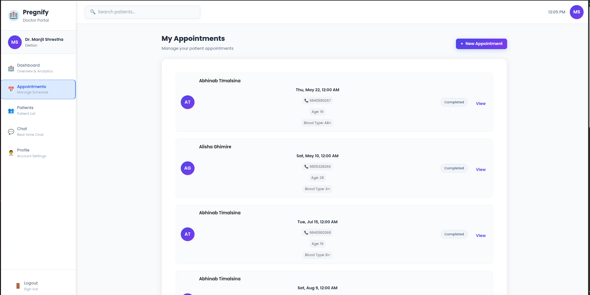
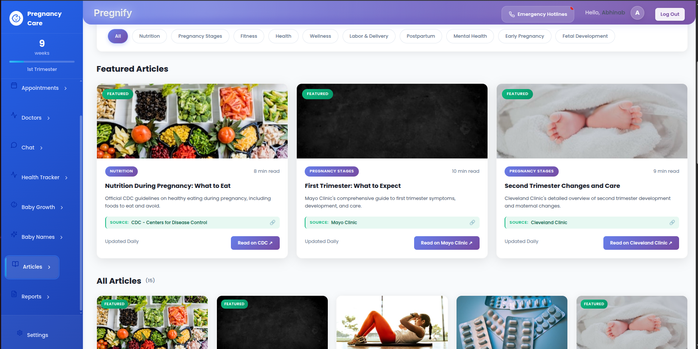
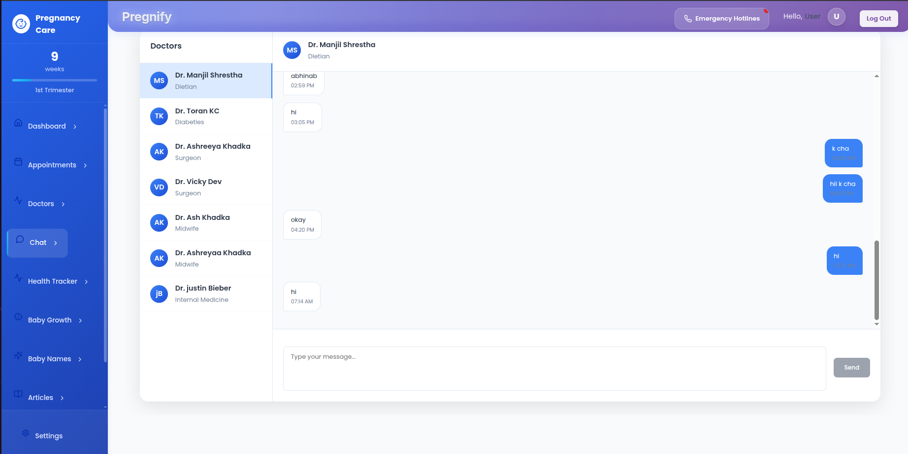
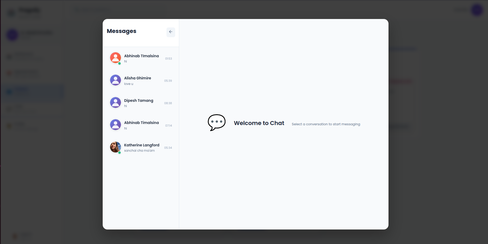
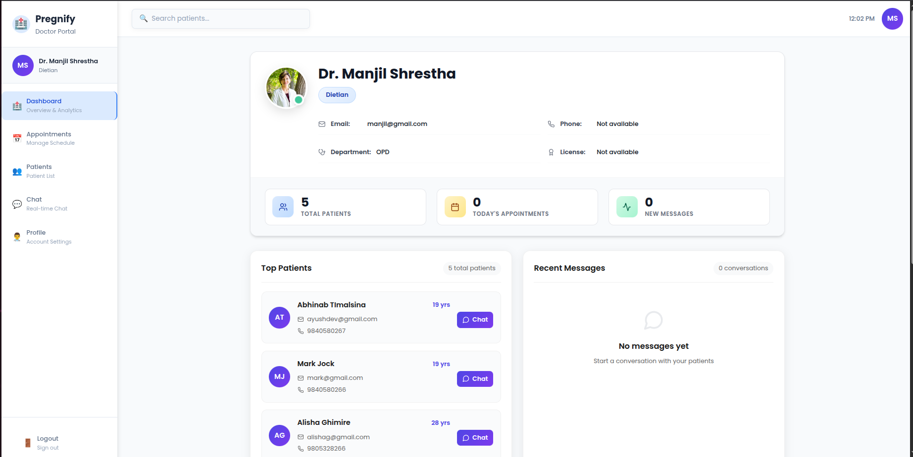
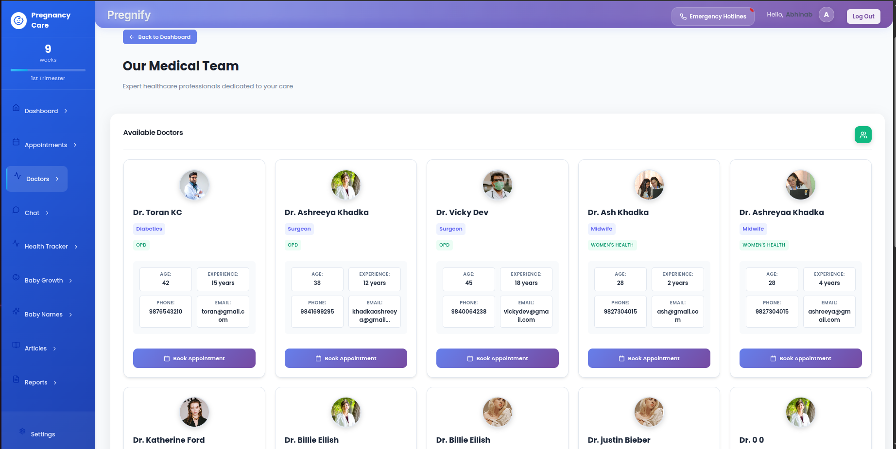
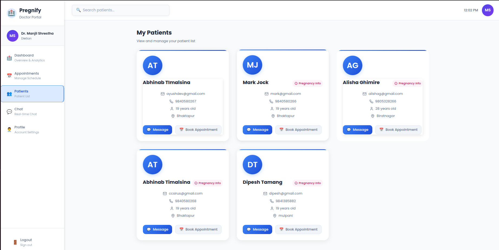
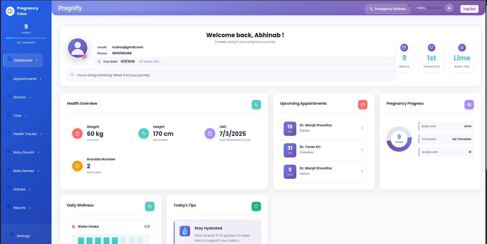

 # Project
 
 
 
 ## Overview
 
 Welcome to the Project repository! This is a modern web application designed to deliver an enhanced experience for health tracking, chat systems, and appointment management. Built with React, Vite, and Tailwind CSS, it features a robust backend powered by Python.
 
 ## Features
 
 - Real-time chat system
 - Health tracker with advanced analytics
 - Appointment scheduling and management
 - Doctor and user profile management
 - Secure file uploads
 - Modern UI with responsive design
 
 ## Getting Started
 
 1. **Clone the repository:**
	 ```bash
	 git clone https://github.com/theaayushdev/Project.git
	 ```
 2. **Install dependencies:**
	 ```bash
	 npm install
	 ```
 3. **Start the development server:**
	 ```bash
	 npm run dev
	 ```
 4. **Backend setup:**
	 - Navigate to the `backend` folder and follow instructions in `README` or run the Python scripts as needed.
 
 ## Screenshots
 
 ### Dashboard
 
 
 ### Health Tracker
 
 
 ### Appointment System
 

### Opening Page


### More Screenshots

#### Appointment Section


#### Articles


#### Chat Feature


#### Cycle


#### Doctor Chat


#### Doctor Dashboard


#### Doctor Selection


#### Grown


#### M1


#### New


#### Patient List


#### User Dashboard


#### Screenshot Example

 
 ## Technologies Used
 
 - Frontend: React, Vite, Tailwind CSS
 - Backend: Python, Flask
 - Database: SQLite
 
 ## License
 
 This project is licensed under the MIT License.
 
 ---
 
 > Made with ❤️ by theaayushdev

